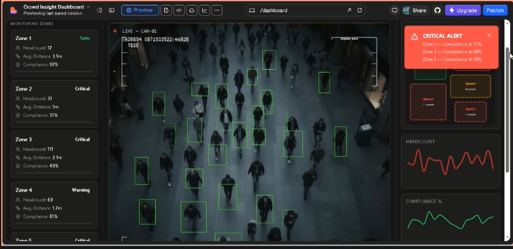
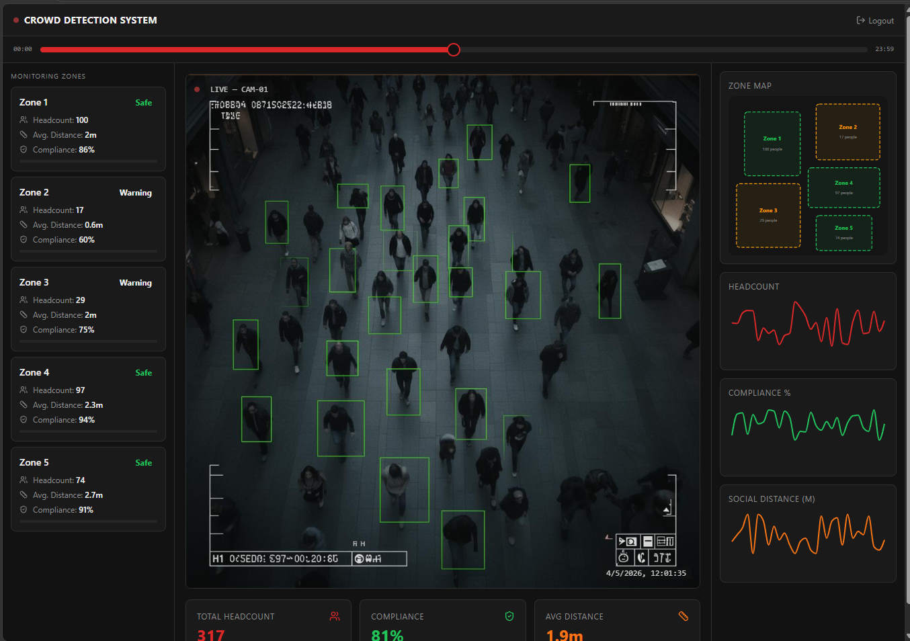
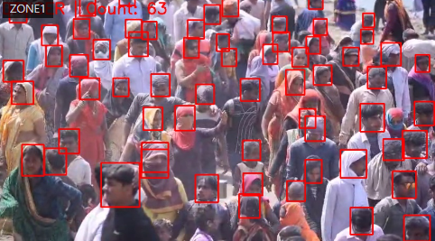

<h1 align="center">
  🤖 AI-Based Crowd Safety & Management System
</h1>

<h3 align="center">
  Real-Time Overcrowding Detection using YOLOv8
</h3>

<p align="center">
  
</p>

<p align="center">
  
  
  
  
</p>

---

## 🎯 Project Overview

An AI-powered crowd monitoring system designed to analyze CCTV video streams, estimate crowd density, detect overcrowding, and generate real-time alerts for proactive crowd safety management.

The system uses **YOLOv8-based object detection** to identify people in video streams and provides a web-based interface for monitoring crowd conditions.

---

## ✨ Key Features

- 👤 Real-time person detection
- 📊 Crowd density estimation
- 🚨 Overcrowding detection
- 🔔 Real-time alert generation
- 📹 CCTV/video stream analysis
- 🌐 Web-based monitoring dashboard
- ⚡ AI-powered computer vision processing

## 🔄 System Workflow

```text
📹 CCTV / Video Stream
          ↓
    🧠 YOLOv8 Model
          ↓
   👤 Person Detection
          ↓
   📊 Crowd Estimation
          ↓
  🚨 Overcrowding Check
          ↓
 🔔 Alert Generation
          ↓
🌐 Flask Web Dashboard
```
---

---

## 📸 Project Demo

### 👤 Real-Time Crowd Detection



### 🌐 Web Dashboard



### 🚨 Overcrowding Detection



---

## 💻 Main Implementation

The core application is implemented in:

📄 **`dashbrdfn.py`**

The script handles the main crowd monitoring workflow, including video processing, YOLOv8-based detection, crowd analysis, and dashboard functionality.

👉 [View the main source code](./dashbrdfn.py)


---

## ▶️ How to Run

### 1️⃣ Clone the Repository

```bash
git clone https://github.com/linkhesh/Ai-Crowd-Safety-yolov8.git
cd Ai-Crowd-Safety-yolov8
```

### 2️⃣ Install Dependencies

```bash
pip install -r requirements.txt
```

### 3️⃣ Run the Application

```bash
python dashbrdfn.py
```

### 4️⃣ Open the Dashboard

After starting the application, open the local Flask address shown in the terminal.

---

## 📁 Project Structure

```text
Ai-Crowd-Safety-yolov8/
│
├── dashbrdfn.py
├── requirements.txt
├── dashboard.png
├── dashboard2.png
├── overcrowding-alert.png
└── README.md
```
